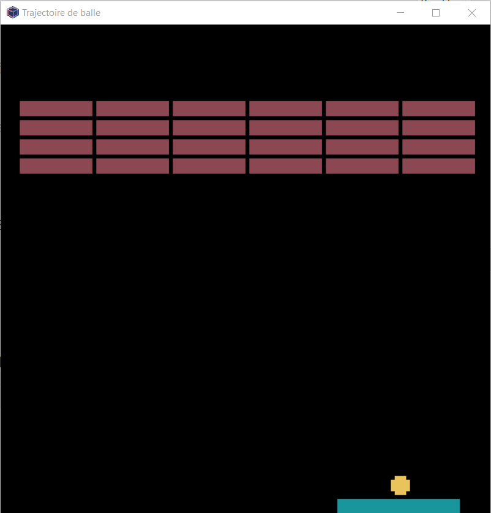

Animation du jeu
================

Maintenant que tous les éléments du jeu sont créés, il reste à écrire les actions dans la fonction ``update`` du module Pyxel.

.. rubric:: Fonction update()

On rappelle les actions à exécuter:

#.  Déplacement de la balle;
#.  Déplacement de la raquette;
#.  Collision entre la balle et la raquette;
#.  Collision entre la balle et les briques;
#.  Collision entre la balle et le bas de la fenêtre provoquant l'arrêt du jeu.

.. note::

    La fonction ``update`` doit utiliser des variables globales pour être accessibles par les autres fonctions du programme.

On obtient le code initial de la fonction ``update``:

.. code-block:: python

    def update():
        global x,y,r,dx,dy,pos,game_over

        pass

.. rubric:: Modifier le début du jeu

En l'état, la balle part du centre de la raquette, elle-même positionnée au centre de l'écran. Cela signifie que toutes les parties sont identiques !

Pour éviter cela, on peut modifier l'emplacement de la balle au début du jeu.

Pour cela, on modifie le code de la fonction update. On ajoute une variable booléenne ``game_on`` initialisée à ``False``. On a donc 2 possibilités:

-   La variable passe à ``True`` et alors le code de jeu s'exécute.
-   La variable est à ``False`` et alors on peut déplacer la raquette avec la balle au centre.

Lorsque la raquette est à l'endroit souhaité pour débuter le jeu, une pression sur la touche **ESPACE** du cavier passe la variable ``game_on`` à ``True`` et le jeu démarre.

Le code à ajouter à la fonction ``update`` est le suivant:

.. code-block:: python

    mouvement_raquette()
    x = (pos + long/2)
    if pyxel.btn(pyxel.KEY_SPACE):
        game_on = True

.. rubric:: Un gagnant à la fin

Actuellement, notre code ne déclare aucun gagnant lorsqu'on a cassé toutes les briques du mur. Pour cela, il suffit de vérifier si le mur de briques est vide.

-   Si la variable ``mur_brique`` est un tableau vide, alors la partie est gagnée et le jeu s'arête.
-   Sinon, la partie continue.

On peut modifier la fonction ``casse_brique`` qui vérifie si le mur de briques est vide. Avant, on crée une variable booléenne ``winner`` initialisée à ``False``.

-   Si la variable ``mur_brique`` est un tableau vide, alors la variable ``winner`` prend la valeur ``True``.
-   Sinon, la variable ``winner`` n'est pas changée et reste à ``False``.

Ensuite, si la valeur de la variable ``winner`` est ``True``, on affiche que la partie est gagnée.

.. rubric:: Autres améliorations

Différentes pistes d'amélioration du jeu sont possibles.

#.  Modifier le mur de briques:

    -   Augmenter le nombre de briques par ligne
    -   Augmenter le nombre de lignes de briques
    -   Avoir une brique spéciale qui accélère la vitesse de la balle

#.  Modifier le mouvement de la balle

    -   Accélérer la balle dans certaines conditions
    -   Modifier la trajectoire de la balle selon l'impact avec la raquette.