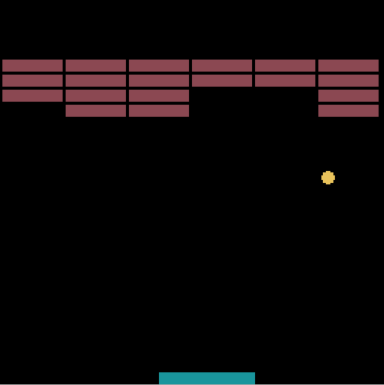

Le jeu du casse-briques
=======================

.. toctree::
   :maxdepth: 1
   :hidden:
   :caption: Casse briques
   
   content/seance_1.rst
   content/seance_2.rst
   content/seance_3.rst
   content/seance_4.rst
   content/seance_5.rst

Le jeu du casse briques est un jeu rétro dont l'objectif est de casser un mur de briques situé en haut de l'écran avec une balle rebondissant sur une raquette qui se déplace horizontalement en bas de l'écran.

On découpe la réalisation de ce jeu en plusieurs séances. La fenêtre de jeu a pour dimensions 128 pixels de côté et pour titre **Casse-Briques**.

#. La première séance est consacrée à la raquette qui se déplace horizontalement en bas de l'écran avec les touches de direction (droite, gauche) du clavier.
#. La seconde séance s'occupe du déplacement de la balle en restant dans la fenêtre.
#. La troisième séance nous amène a gérer la collision de la balle sur la raquette.
#. La quatrième séance pour la construction du mur de briques et les collisions avec la balle.
#. La dernière séance pour optimiser le code, gérer les éventuels bugs, la fin du jeu et le traitement du score.

Après ces 5 séances, les plus rapides et motivés pourront apporter quelques modifications au jeu pour le rendre plus interactif.
