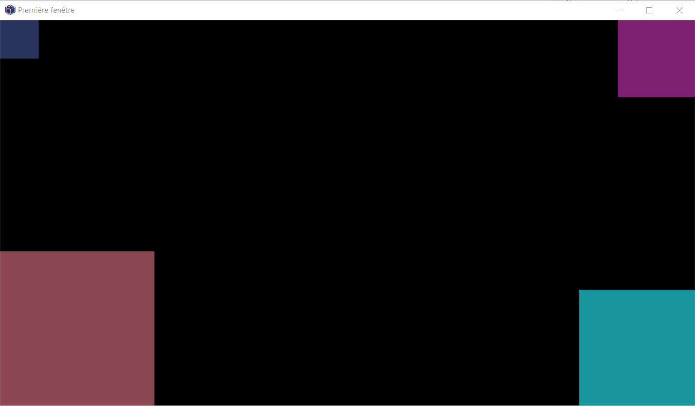

Entrainement sur Pyxel
======================

Gérer la fenêtre graphique
--------------------------

L'objectif est de comprendre le repérage des éléments dans la fenêtre graphique et de maitriser le positionnement des différents éléments dans la fenêtre graphique.

   
#. Créer une fenêtre graphique de largeur 180 et de hauteur 100 de titre "My first window".
#. Dessiner un carré en haut à gauche de la fenêtre graphique de dimensions 10 pixel de couleur 1.
#. Dessiner un carré en haut à droite de la fenêtre graphique de dimensions 20 pixel de couleur 2.
#. Dessiner un carré en bas à droite de la fenêtre graphique de dimensions 30 pixel de couleur 3.
#. Dessiner un carré en bas à gauche de la fenêtre graphique de dimensions 40 pixel de couleur 4.

Animer un élément
-----------------

L'objectif est de créer un déplacement d'un élément graphique tout en gérant sa position dans la fenêtre graphique.

#. Créer une fenêtre graphique de largeur 128 sur une hauteur de 128 de titre "Première animation".
#. Dessiner un carré de côté 10, sur le bord gauche de la fenêtre à mi hauteur.
#. Créer un déplacement de ce carré de la gauche vers la droite.
#. Stopper le mouvement de ce carré lorsqu'il arrive sur le côté droit de la fenêtre.
#. Créer un déplacement de ce carré de la droite vers la gauche.
#. Créer un mouvement de va et vient sans que le carré ne sorte de la fenêtre.
#. Créer un déplacement du carré tout autour de la fenêtre graphique sans déborder.

Interagir au clavier avec un élement
------------------------------------

L'objectif est d'apprendre à déplacer un élément dans la fenêtre graphique avec les touches de direction du clavier sans que l'élément ne sorte de la fenêtre graphique.

#. Créer une fenêtre graphique de largeur 128 sur une hauteur de 128 de titre "Première interaction".
#. Dessiner un carré de côté 10 placé au centre de la fenêtre.
#. Créer un déplacement de ce carré de la gauche vers la droite lorsqu'on appuie sur la touche de direction **droite**.
#. Créer un déplacement de ce carré vers les autres directions lorsqu'on appuie sur une touche de direction correspondante.
#. Gérer le déplacement de votre carré pour qu'il ne sorte pas de la fenêtre.

Optimiser son code
------------------

Si vous n'avez pas encore optimisé votre code:

- Remplacer les dimensions fixes de la fenêtre par 2 constantes ``LARGEUR`` et ``HAUTEUR`` déclarées en début de programme.
- Modifier le code en utilisant les constantes ``LARGEUR`` et ``HAUTEUR``. Vérifiez que le code est toujours fonctionnel en modifiant les dimensions de ces constantes!
- Remplacer les dimensions du carré par une constante ``COTE`` déclarée en début de programme.
- Modifier le code en utilisant cette nouvelle constante. Vérifiez que tout est toujours fonctionnel en modifiant la valeur de la constante ``COTE``.